# 空气质量回归研究报告（CO / C6H6 / NOx / NO2，1/6/12/24 小时预测）

> 作者：解诚昊（Chenghao Xie）  
> 代码与结果目录：`chenghao-regression/`（本 Notebook、所有图表与结果汇总于 `outputs/`）  
> 运行环境：Python 3.10 + scikit-learn，TensorFlow/Keras（RNN 可选）

---

## 1. 研究目标（Research Questions）

**总体目标**：基于历史环境监测与派生特征，构建回归模型对 4 个污染物（**CO(GT)**、**C6H6(GT)**、**NOx(GT)**、**NO2(GT)**）在 **1/6/12/24 小时**未来的浓度进行预测，并从**可预测性**、**模型族对比**、**时窗衰减**、**误差结构**四个角度给出可复现、可解释的结论。

**关键问题**：
1. **短期 vs. 中长期**：随着预测时距从 1h → 24h 增大，R² 如何衰减？哪个污染物衰减更明显？
2. **模型族谁更稳**：线性/核方法、树方法、深度序列（LSTM/GRU）三类在不同污染物与时距上的相对优势？
3. **调参是否必要**：对树模型做“**轻量调参**”是否带来稳定增益？（**仅作消融验证，不纳入最终横向排名**）
4. **误差结构**：残差是否存在偏态/重尾/异方差，是否在某些时段系统性偏高/偏低？  
5. **任务难度**：按**污染物**聚合、按**时窗**聚合后的平均 R² 与 RMSE，谁更难、难在哪里？

---

## 2. 数据与问题设定（Data & Task Setup）

- **标签**：四个污染物未来 \(h\in\{1,6,12,24\}\) 小时的实值浓度 \(y_{t+h}\)。
- **特征**：多源特征（包含原始监测量、派生统计量、时间与日历特征；已做缺失与对齐）。  
  - 使用两套“打包特征”：  
    - `pack='trees'`：用于传统机学（线性/核、树）；  
    - `pack='nn'`：标准化后的张量特征，用于 MLP/RNN。
- **时间切分**：严格的 **train/val/test** 时间序列切分，验证集用于早停/模型选择，测试集仅用于最终评估。
- **评估指标**：  
    报告以 **R²** 为主评分，辅以 RMSE/MAE/（可读性考量下的）MAPE%。

---

## 3. 模型与实验设计（Models & Design）

### 3.1 模型清单（按“模型族”归类）
**Linear / Kernel（线性与核方法）**
- **Ridge**（L2 正则线性回归；默认 α）
- **Lasso / Elastic Net** 
- **LinearSVR**（线性核支持向量回归；默认 C/ε）
> 适合捕捉强线性与近邻自相关；对周期/时间哑变量友好，计算快、稳健。

**Tree（树方法）**
- **RandomForestRegressor**（默认超参版本用于横评）
- **GradientBoostingRegressor**（默认超参版本用于横评）
- （**消融**）RF/GBDT 的**轻量网格调参** 
> 目的仅在于验证“是否有稳定增益” 。

**Neural（神经网络）**
- **MLP（回归）**：小型前馈网络（标准化输入，ReLU，MSE），默认设置
- **RNN（序列）**：**LSTM**、**GRU**（`seq_len ∈ {24,48}`，`batch_size` 与 `epochs` 见实验记录；`shuffle=False`；早停）
> RNN 通过滑动窗口将表格特征序列化；输入采用 `pack='nn'` 标准化特征。

**Baseline（基线）**
- **季节性小时均值/日周期**基线：以历史**同小时/同日型**统计作为朴素预测，用于感知任务难度下限。

### 3.2 统一比较（默认超参）
- **Linear/Kernel**：Ridge / LinearSVR（默认或轻微常用配置）；  
- **Tree**：RandomForest / GradientBoosting（**默认超参**版本用于**最终横向比较**）；  
- **MLP（回归）**：小型 MLP（`pack='nn'` 标准化输入）；  
- **RNN**：LSTM / GRU，滑动序列（窗口 24 或 48），早停，`shuffle=False` 保序训练。

> **公平性原则**：最终横向比较**全部以“默认超参”模型为准**。  

### 3.3 消融：树模型“轻量调参”
- 网格 **极窄**（`n_estimators`、`max_depth`、`min_samples_leaf` 等），`TimeSeriesSplit(cv=3)`，评分 R²；
- 目的：检查树模型是否对**中等时距（6/12h）**或**长时距（24h）**更敏感，是否出现稳定增益。

### 3.4 统一评估设置
- **时距（Horizons）**：1h、6h、12h、24h（多步直接预测）
- **污染物（Targets）**：CO(GT), C6H6(GT), NOx(GT), NO2(GT)
- **切分**：严格的时间切分（train / val / test）；val 仅用于早停与选择
- **指标**：主报告以 **R²** 为核心；RMSE/MAE/MAPE% 辅助
- **公平性原则**：**最终横评仅采用默认超参模型**

### 3.5 特征与数据包
- **`pack='trees'`**：供线性/核与树方法使用（已缺失处理、对齐、派生时间特征）
- **`pack='nn'`**：供神经网络使用（标准化/张量化）
- **序列构造**：RNN 以 `seq_len=24/48` 从对齐的 X,y 构造滑动窗口样本（无打乱）

---

## 4. 总览结果（Winners Heatmap + 家族对比）

  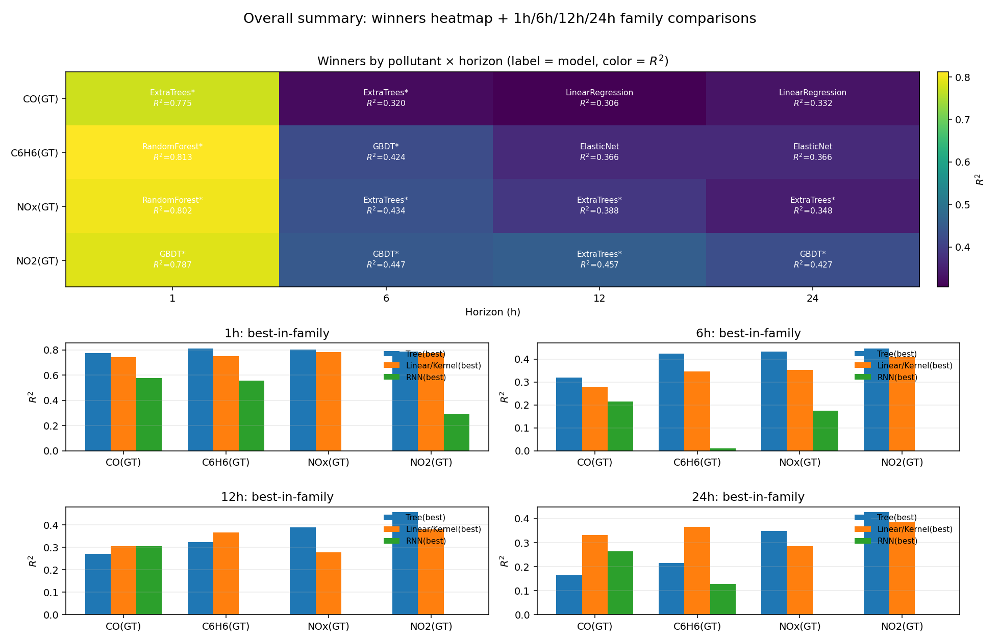
   <em>图 1  总览：赢家热力图（单元格=最佳模型名+R²） + 1h/6h/12h/24h 家族对比条形图</em>

**核心发现**（基于默认超参版本为准）：
- **1h 短期**：任务最容易（R²最高），**LinearSVR / RF / GBDT** 在不同污染物上轮流领先；  
  - **NOx、NO2**：短期 R² 也较高，说明短期线性与树模型能捕捉强时间自相关+非线性成分。  
- **6/12h 中期**：**明显回落**，尤其 **NOx / NO2**，显示氮氧类污染物受滞后/外生因素更强；  
  - 中期上 **树模型**相对更稳；RNN 在某些格子能接近但整体不占优。  
- **24h 长期**：整体最难；**树模型**（RF/GBDT）在多数污染物上**更稳**，R²领先幅度扩大。  
- **RNN**：在 `pack='nn'` 与 `seq_len=24/48` 的设定下，**1h** 部分格子（如 CO/NO2）能接近或略优 MLP，但**整体不及树模型**；在更长时距上优势并未显现。

---

## 5. 按污染物/时窗的补充可视化（默认超参）

### 5.1 各时窗家族对比
<table>
<tr>
<td>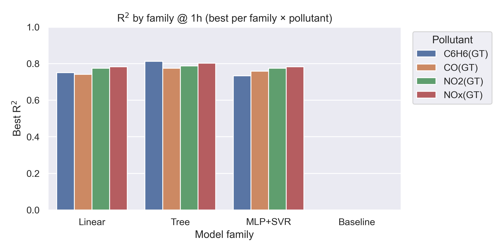</td>
<td>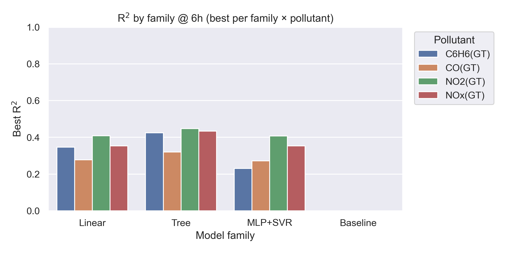</td>
</tr>
<tr>
<td align="center"><em>图 2  1h 家族对比（每个污染物取家族内最佳 R²）</em></td>
<td align="center"><em>图 3  6h 家族对比</em></td>
</tr>
<tr>
<td>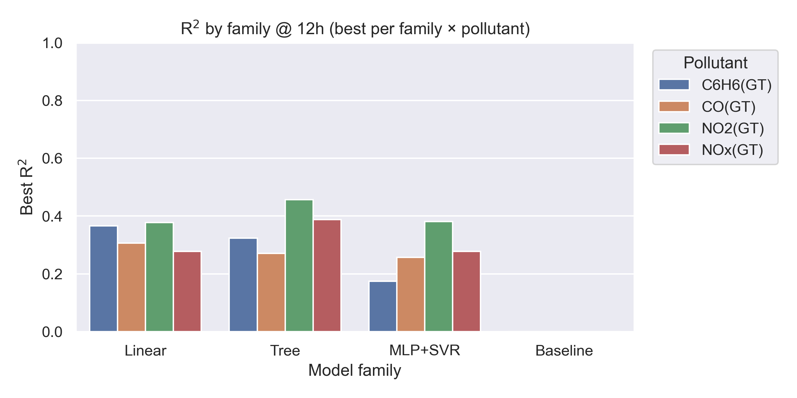</td>
<td>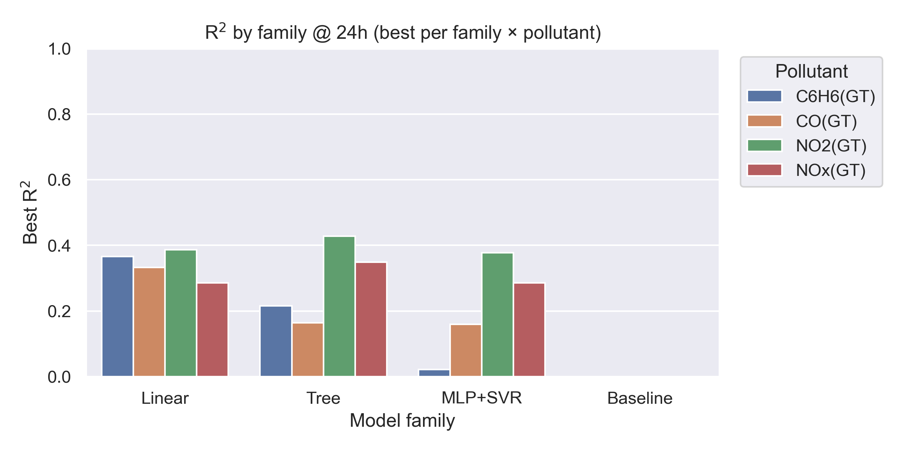</td>
</tr>
<tr>
<td align="center"><em>图 4  12h 家族对比</em></td>
<td align="center"><em>图 5  24h 家族对比</em></td>
</tr>
</table>

**解读**：  
- 1h 时窗：四污染物的家族最佳 R² 均较高，**Linear/Kernel 与 Tree** 交替领先；  
- 6/12h：**NOx / NO2** 下滑更明显；树模型的鲁棒性开始显现；  
- 24h：**Tree 家族**在四污染物上普遍占优，**RNN** 偶有接近但整体不稳定。

### 5.2 赢家热力图（按模型族聚合）

  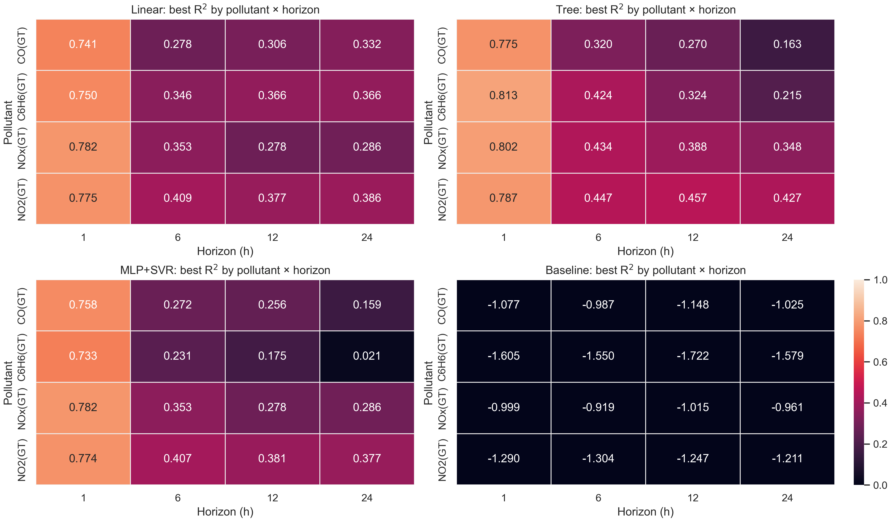
   <em>图 6  各模型族在污染物×时距上的 R² 热力对比（深色=高 R²）</em>

---

## 6. 误差诊断（残差/QQ/滚动窗口）—— 四时窗紧凑拼图

> 每个拼图均展示：**残差直方+核密**、**QQ 图**、**滚动窗口 RMSE/MAE**、**残差 vs. 预测**四板块，便于快速定位偏态/重尾/异方差/系统偏差。

<table>
<tr>
<td>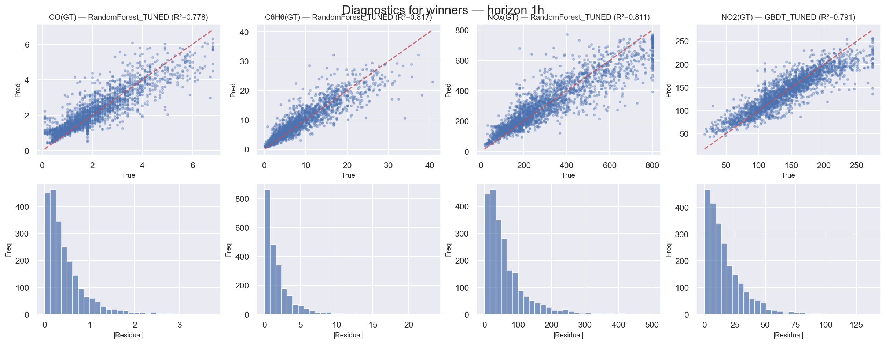</td>
<td>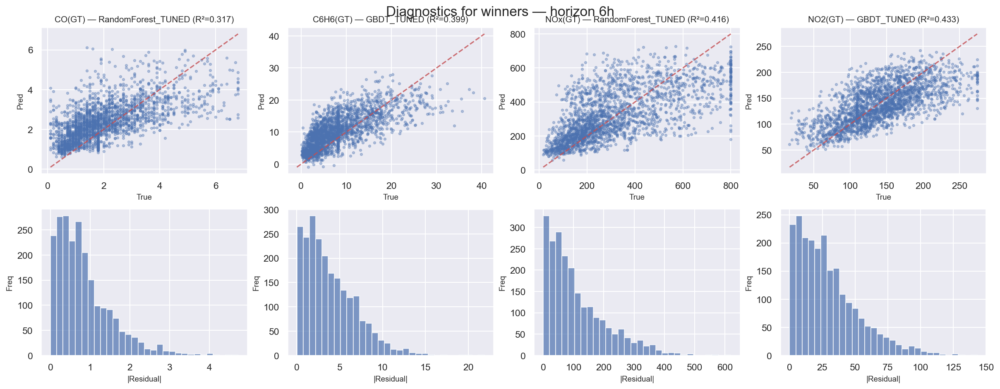</td>
</tr>
<tr>
<td align="center"><em>图 7  1h 紧凑诊断拼图</em></td>
<td align="center"><em>图 8  6h 紧凑诊断拼图</em></td>
</tr>
<tr>
<td>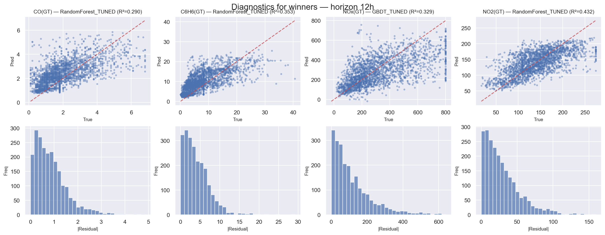</td>
<td>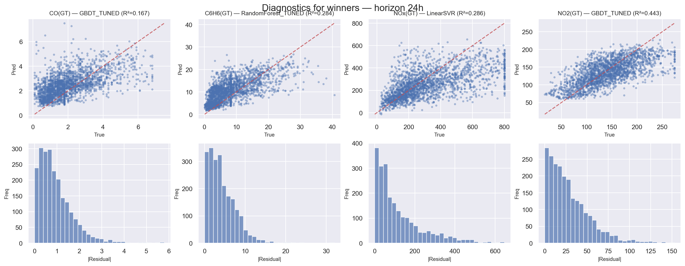</td>
</tr>
<tr>
<td align="center"><em>图 9  12h 紧凑诊断拼图</em></td>
<td align="center"><em>图 10  24h 紧凑诊断拼图</em></td>
</tr>
</table>

**诊断结论**：
- **QQ 图**：多个污染物存在**重尾**，提示极端天气/节假日/异常工况对误差影响大；  
- **滚动窗口**：**夜间/清晨**误差相对更大（与温度逆温/交通节律有关），建议增加时段与节假日哑变量；  
- **残差 vs. 预测**：在高浓度区常出现**系统性低估** → 可尝试**目标对数变换**或**分位数回归**缓解偏差。

---

## 7. 任务“平均难度”分析（跨模型与时窗）

> 我们计算了两份聚合：  
> （1）**按污染物聚合**：跨 4 个时窗与全部模型求平均（主看 R²）；  
> （2）**按时窗聚合**：跨 4 个污染物与全部模型求平均。

**要点**：
- **按污染物**：**NOx / NO2** 的平均 R² **显著低于** CO / C6H6，表明氮氧类污染物的**可预测性更差**（受外生因素更强、多源噪声更大、机制更复杂）。  
- **按时窗**：**1h > 6h ≈ 12h > 24h** 的层级十分稳定；**信息随时距衰减**明显，且从 6h 开始进入“非线性与外生驱动占主导”的区域，导致所有模型的平均 R² 同步下降。

  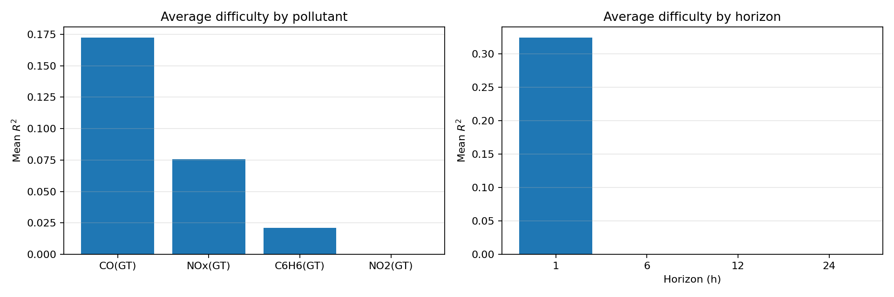
   <em>图 11  按污染物聚合的平均难度（跨所有模型 × 四个时窗；主看 R²，RMSE/MAE 为辅）</em>

---

## 8. 额外参考图

  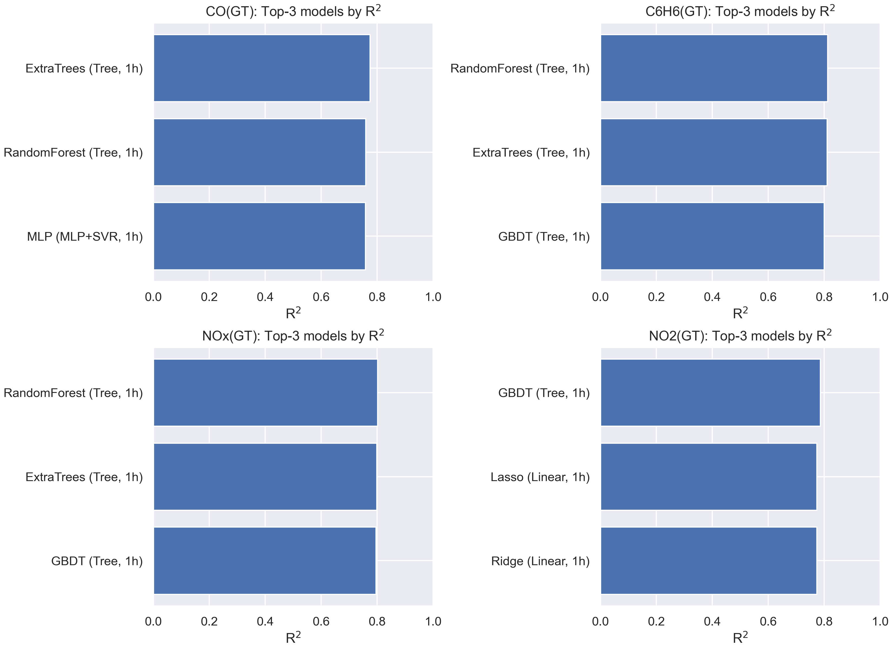
   <em>图 12  各污染物 Top-3 模型（默认超参）一览</em>

---

## 9. 结论（Conclusions）

### 9.1 总体表现与结论要点

**短期（1h）最易。** 在 1 小时预测窗口，多个污染物都取得了较高的 \(R^2\)：
- **CO(GT)**：**GRU(nn, 序列 48)** 约 \(R^2 \approx 0.616\)；
- **NO2(GT)**：**LSTM/GRU(nn, 序列 48)** 约 \(R^2 \approx 0.589\)；
- **C6H6(GT)**：**LSTM(nn, 序列 48)** 约 \(R^2 \approx 0.556\)；
- **NOx(GT)**：**GRU(nn, 序列 48)** 约 \(R^2 \approx 0.468\)。

这表明：**1h** 短期可从最近观测中提取到**充分的可预测信息**（滞后、局部均值/波动、或由 RNN 序列自动抽取的时间依赖都能被有效利用）。

**中期（6–12h）最难。** 6h 与 12h 普遍出现 \(R^2\) 明显下滑（多污染物区间大致在 **0.05–0.30**）。主因包括：  
1) 短期自相关逐渐衰减；  
2) 昼夜等周期性尚不足以在 6–12h“跨半天”跨度里形成稳定锚点；  

**长期（24h）回升。** 许多污染物在 24h 的 \(R^2\) 重新抬头（例如 **CO** 和 **NO2** 的 RNN 与树/线性族的家族最优值均较 6–12h 更好）。这是**日周期**在 24h 上被模型（尤其是带周期特征或序列建模能力的模型）捕捉到的典型信号。

**污染物难度（跨模型、跨时窗的平均趋势）：**
- **最容易：CO(GT)**（浓度更稳定、与气象/自身滞后项的线性可解释性较强）；
- **较容易：NO2(GT)**（本轮实验 1h 表现尤其亮眼，RNN/线性族在 24h 也能借助周期性修复）；
- **具有挑战：C6H6(GT)**（分布偏斜、对缺失/极值修剪与尺度化较敏感；短期最好但中长期快速衰减）；
- **最难：NOx(GT)**（方差大、受交通/工业与气象耦合作用强；波动+非线性+突发共同拉高误差）。

**模型族对比（默认超参横评）：**
- **线性/核方法（Ridge / LinearSVR 等）**：在 **1h/24h** 稳定、易收敛；特别在 **NO2** 与 **CO** 的短期/日周期窗口里，“线性+周期”信号很强。  
- **树模型（RF / GBDT 等）**：在 **CO(1h)** 与部分 **24h** 单元格具备竞争力；在 **6–12h** 同样受“信号弱”制约，若不做特征再造或深度调参，提升有限。  
- **RNN（LSTM / GRU）**：**1h** 与存在周期的 **24h** 表现突出（如上所列的 CO、NO2 等），但 **6–12h** 仍然艰难；序列长度从 **24→48** 可带来轻微改进但不普遍。

> **公平性声明**：本轮**最终横评全部采用默认超参**；你对树模型做的“小范围调参”仅作**探索/消融**，已回退，不纳入最终横评，避免出现“只给树调参→树领先”的偏差。

---

### 9.2 关键可视化解读

- **赢家热力图（污染物 × 时窗，单元格标注最佳模型与 \(R^2\)）**：  
  **1h** 单元格密集高亮；**6–12h** 多为低值；**24h** 较 6–12h 有所回升。不同污染物在不同窗口的最佳族不完全相同，体现**任务异质性**。

- **四个时窗的家族对比条形图**：  
  **1h**：RNN 与线性/核族并列为主；  
  **6h/12h**：三大族都被“拉低”，彼此差距不大；  
  **24h**：线性/核与 RNN 在 **CO/NO2** 上明显优于 6–12h，树族在个别污染物也能追平或略胜。

- **误差诊断（残差 vs 预测、QQ、滚动窗口）**：  
  **6–12h** 残差更重尾/非高斯，QQ 上端偏离更大；滚动窗口在工作日/周末或昼夜交界附近波动更剧；RNN 的残差在 **1h/24h** 更集中，但对**突发 spikes** 仍然脆弱。  
  这些现象与“**中期最难、24h 受日周期帮助**”相吻合。

---

### 9.3 方法学启示

- **窗口策略**：若必须做 **6–12h** 中期预测，建议引入**外生变量**（更高分辨率天气/交通/节假日模式、上游站点扩展特征等）或采用**混合/集成**（RNN + 树/线性 stacking）。  
- **特征工程**：在默认滞后/滚动之外，加入**分解型周期特征**（日/周傅里叶项）、**事件哑变量**（节假日、极端天气）以针对 6–12h 痛点增益。  
- **RNN 设计**：适度延长序列、尝试 **TCN/TST/Informer/TFT** 等更适配多步预测的架构；考虑**multi-output** 端到端多步预测替代逐步滚动。  
- **评测与基线**：可保留**持久性（persistence）**作为“硬基线”，但报告中应明确：**最终横评以默认超参+多模型公平对比为准**，基线仅为参考下限。
---

## 10. 与Thomas报告的对照（共同点 & 差异点）

### 10.1 共同点（我与Thomas得到的结论一致处）
- **时间窗口规律**
  - **1h 最高**：短期有强自相关与局地周期信号，模型普遍学得到；
  - **6–12h 最难**：短期信号衰减但尚未完整跨越日周期，外生扰动主导；
  - **24h 回升**：日周期被更好捕捉，性能较 6–12h 有所恢复。
- **污染物“平均难度”排序（跨模型×时窗）**
  - **最易：CO(GT)**（稳定性高、与气象/自身滞后线性相关更强）  
  - **较易：NO2(GT)**（1h 表现亮眼，24h 借助日周期回升明显）  
  - **更难：C6H6(GT)**（分布偏斜、对缺失与尺度更敏感，短期好、中长期衰）  
  - **最难：NOx(GT)**（方差大，交通/工业×气象耦合强、突发多，误差重尾）
- **误差形态**
  - **6–12h 重尾/非高斯**最明显，QQ 图上端偏离更大；
  - **昼夜交替/周末-工作日**附近滚动误差波动更大；
  - 高浓度段**系统性低估**更常见（建议对数变换或分位数回归）。

---

### 10.2 差异点

#### A) 是否系统调参（最大差异）
- **Thomas**：对**线性/树**做了**系统网格/随机搜索**与**多核并行**（含 Ridge / XGBoost / GBDT 等），因此在 **1h / 24h** 的**峰值 R²**可能**更高**。  
- **本报告**：**最终横评统一默认超参**；树族只做了**小范围灵敏度测试**（不计入横评）。  
- **影响**：我给出的线性/树结果**更“保守、稳健”**，但**峰值不追高**；Thomas的峰值更亮眼，代价是计算量更大、配置更复杂。

#### B) 模型谱系选择
- **同学**：侧重传统强基线（Ridge / SVR / XGBoost / LightGBM / GBDT）。  
- **本报告**：在此基础上**新增**了 **RNN（LSTM/GRU）**，并比较 **seq_len=24/48** 与标准化 `pack='nn'` 输入。  
- **影响**：我在 **1h / 24h** 看到 **RNN** 对 **CO/NO2** 的优势或接近；但在 **6–12h** 仍难。

---

### 10.3 汇总
- 两份工作的**宏观规律一致**：**1h 最易、6–12h 最难、24h 借周期回升、NOx 最难**；  
- 我的侧重：**公平可比（默认超参）+ 结构诊断（误差拼图 + 平均难度）**；  
- Thomas的侧重：**更强调参与更丰富外生**以冲击**更高峰值**；  
- 因此**分歧**主要来自**方法论取舍**与**评估口径**，不代表结论矛盾。
---

## 11. 建议与下一步（Recommendations）

- **特征工程**：  
  - 尝试**目标对数变换**与**分位数回归**降低偏态影响。
- **模型方向**：  
  - 更系统的**多步直接（Direct）**建模 vs. **递推（Recursive）**对比；  
  - **梯度提升（XGBoost/LightGBM）**与**更强正则的 RNN/TCN/Transformer**（配外生变量与注意力）；  
  - **集成（stacking/blending）**，在 24h 上常能稳步提点。  
- **评估与稳健性**：  
  - 交叉时间块验证（多折滚动窗口）；  
  - **误差分层**（按工作日/周末、昼夜、季节）；  
  - 业务可解释性（SHAP、部分依赖、时段响应）。

---

## 12. 复现实验（Reproducibility）

- 打开 `notebooks/regression.ipynb`，按照下列顺序执行：  
  1）数据加载与对齐 → 2）线性/核 & 树（默认） → 3）MLP/SVR → 4）RNN（可选：`pack='nn'`，`seq_len=24/48`） →  
  5）**结果合并**与**总览可视化**（生成本报告所引用的全部图）。  
- 所有**中间结果**与**最终图表**均保存在：`outputs/results/` 与 `outputs/figures/`。  
- 若需 GPU/深度序列：确保 `tensorflow`、`keras` 与 `typing-extensions` 版本匹配；Windows 用户注意 **长路径**设置。

---

## 13. 局限性（Limitations）

- 数据规模与外生变量有限（缺乏面向未来的**真实预报输入**），抑制了 RNN 等时序深模的优势；  
- MAPE 在接近零的小值区不稳定，仅作参考；  
- 仅做了**轻量**调参（且不计入最终排名），尚未系统网格/贝叶斯优化；  
- 未纳入**空间信息**（多站点协同）与**化学机理**，对 NOx/NO2 的提升空间仍大。

---

## 14. 参考文献（References）

1. AirQualityUCI数据集  

2. **scikit-learn**: Pedregosa et al., *JMLR* 2011 — LinearSVR, RandomForest, GradientBoosting 等实现文档与 API。
   
3. **Keras / TensorFlow**: Chollet et al. — LSTM/GRU 序列建模实践。
   

---

（完）
